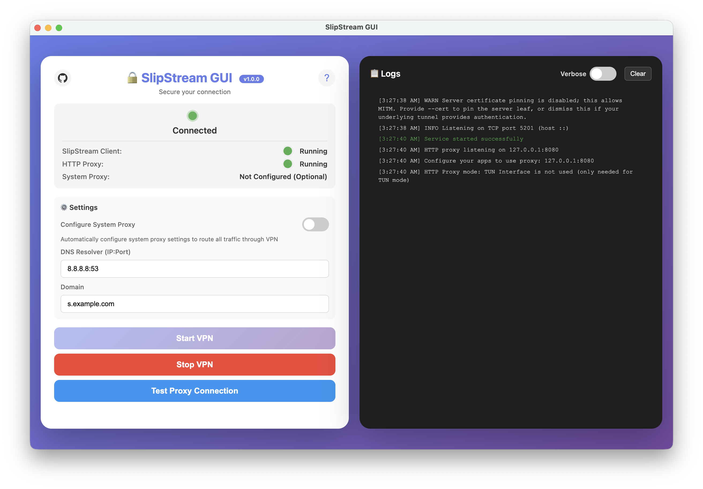
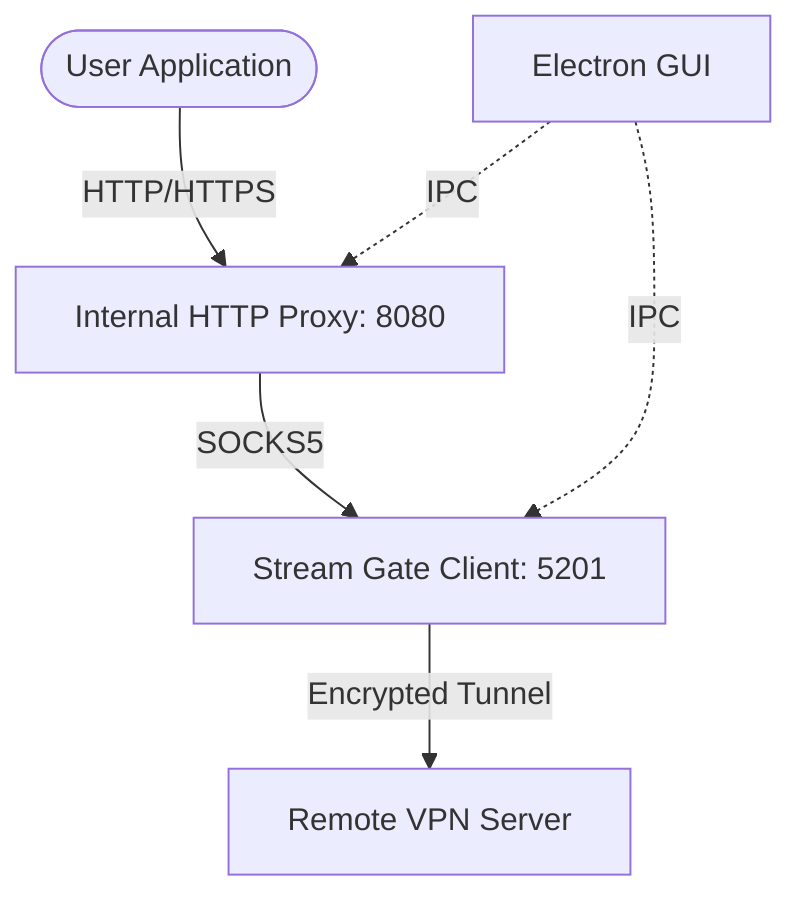

# Stream Gate

<div align="center">
  
  <br>
  
  [](https://github.com/free-mba/Stream-Gate/releases)
  [](LICENSE)
  [](https://github.com/free-mba/Stream-Gate/releases/latest)
  [](https://github.com/free-mba/Stream-Gate/actions)
</div>

<br>

<div align="center">
  <strong>The Ultimate GUI Client for SlipStream</strong><br>
  A high-performance, cross-platform VPN utility engineered for speed, privacy, and seamless tunneling.
</div>

<div align="center">
  <br>
  <a href="README-EN.md">Documentation (English)</a> • <a href="README-FA.md">راهنمای فارسی</a> • <a href="docs/STYLE_GUIDE.md">Style Guide</a>
</div>

---

## ✨ Experience Precision Performance

**Stream Gate** isn't just another VPN client. It's a meticulously designed tool that bridges the gap between complex tunneling protocols and user-friendly experience. Built on Electron and powered by a high-efficiency backend, it offers system-wide tunneling with zero-configuration ease.

### 🎯 Featured: Advanced DNS Tester
Our proprietary DNS Tester is the crown jewel of Stream Gate. Specially optimized for this protocol, it accurately identifies compatible DNS overrides with an **85% detection success rate**.
- **Mass Scaling**: Test dozens of resolvers in seconds.
- **Smart Filtering**: Automatically highlights compatible servers.
- **One-Click Apply**: Instantly inject the best-performing DNS into your active configuration.

### 🎨 Premium UI & Masterful UX
Experience an interface that feels alive. Stream Gate features:
- **Glassmorphism Design**: A modern, translucent aesthetic that fits perfectly on macOS, Windows, and Linux.
- **Dark & Light Modes**: Seamlessly switch themes with perfect contrast and color harmony.
- **Bilingual Mastery**: Full support for English (LTR) and Persian (RTL) with localized interfaces and optimized typography.

### ⚡ Power Features for Power Users
- **Bulk Import/Export**: Manage hundreds of configurations effortlessly. Supports bulk `ssgate` link processing.
- **System-Wide Tunneling**: Routes all traffic through our secure HTTP/SOCKS5 hybrid proxy.
- **Real-Time Traffic Analytics**: Monitor your bandwidth with precise download/upload telemetry.
- **Cross-Platform Parity**: Identical feature set and performance across all desktop operating systems.

---

## 📥 Download & Install

Download the latest release for your platform:

| Platform | Download |
|:---|:---|
| macOS (Apple Silicon) | [Stream-Gate-macOS-ARM64.dmg](https://github.com/free-mba/Stream-Gate/releases/latest/download/Stream-Gate-macOS-ARM64.dmg) |
| macOS (Intel) | [Stream-Gate-macOS-Intel.dmg](https://github.com/free-mba/Stream-Gate/releases/latest/download/Stream-Gate-macOS-Intel.dmg) |
| Windows (64-bit) | [Stream-Gate-Windows-x64.exe](https://github.com/free-mba/Stream-Gate/releases/latest/download/Stream-Gate-Windows-x64.exe) |
| Windows (32-bit) | [Stream-Gate-Windows-x86.exe](https://github.com/free-mba/Stream-Gate/releases/latest/download/Stream-Gate-Windows-x86.exe) |
| Linux (x86_64) AppImage | [Stream-Gate-Linux-x64.AppImage](https://github.com/free-mba/Stream-Gate/releases/latest/download/Stream-Gate-Linux-x64.AppImage) |
| Linux (x86_64) DEB | [Stream-Gate-Linux-x64.deb](https://github.com/free-mba/Stream-Gate/releases/latest/download/Stream-Gate-Linux-x64.deb) |
| Android | [SlipNet](https://github.com/obscuraio/SlipNet) (Recommended Client) |

---
<br>

> [!CAUTION] 
> **macOS: App is damaged and can’t be opened?**  
> If you see the error *"Stream Gate is damaged and can’t be opened"*, run this command in Terminal:  
> ```bash
> xattr -cr /Applications/Stream\ Gate.app
> ```

---

## 🚀 Quick Launch Guide

1. **Install**: Grab the latest installer for your OS and run it.
2. **Configure**: Select a pre-configured server or import your own via `ssgate` links.
3. **Scan (Optional)**: Use the **DNS Tester** to find the fastest compatible resolver.
4. **Connect**: Flip the switch and enjoy a secure, accelerated internet experience.

---

## 🛠 Project Architecture

Stream Gate utilizes a robust multi-layered architecture to ensure reliability and speed.

For a comprehensive breakdown of the Frontend, Backend, and Data Flow, please consult our **[Architecture Guide](docs/ARCHITECTURE.md)**.



- **Electron & React**: Modern, responsive frontend.
- **Node.js**: Service-based architecture for low-latency IPC.
- **Microservices Pattern**: Decoupled modules for Process Management, Proxying, and DNS Testing.

---

## 🤝 Contribution & Support

Stream Gate is an open-source project driven by the community. We welcome contributions of all kinds!

👉 **Read our [Contribution Guidelines](CONTRIBUTING.md) to get started.**
- **Bugs & Features**: Open an issue on our [GitHub repository](https://github.com/free-mba/Stream-Gate).
- **Security**: Please report security vulnerabilities via private disclosure.

## 🙏 Acknowledgments

Stream Gate is built on the shoulders of giants. Special thanks to the following projects and creators:
- [**slipstream-rust**](https://github.com/Mygod/slipstream-rust) by Mygod
- [**SlipStreamGUI**](https://github.com/mirzaaghazadeh/SlipStreamGUI) by mirzaaghazadeh

---

<div align="center">
  <br>
  <strong>Made with ❤️ for the future of open internet.</strong>
</div>
